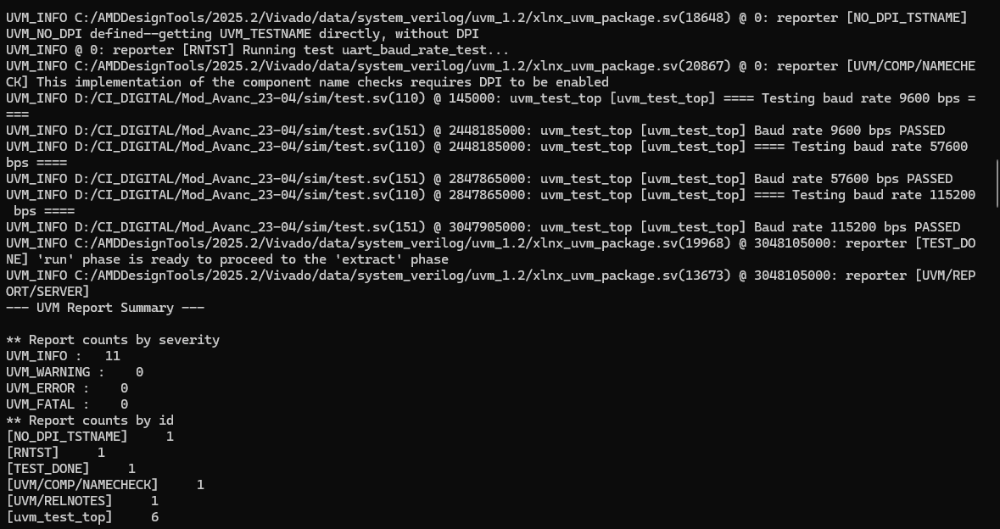

# SD242 – Atividade UVM UART

> ALUNO: Hyago Vieira Lemes Barbosa Silva | email: hyago.silva@mtel.inatel.br | hyago.silva@mtel.inatel.br

### Desenvolvimento
- VSCode
- Vivado TCL Shell

## Objetivo
Foi desenvolvido um novo caso de teste independente do teste original de comunicação, conforme solicitado na atividade. O teste implementado avalia um elemento adicional da UART, com foco na configuração de baud rate.

## Arquivos alterados
- `sim/test.sv`;
- `config.tcl` (apenas para selecionar qual teste será executado);

## Teste implementado
Para atender à atividade, foi adicionado o seguinte elemento no ambiente de verificação:

### Em `sim/test.sv`
- classe `uart_cfg_base_test`, utilizada como base para inicialização de clocks, reset e configuração do DUT;
- classe `uart_baud_rate_test`, criada para validar a operação da UART em diferentes baud rates;

## Teste – Variação de baud rate
### Objetivo
Verificar se a UART opera corretamente com diferentes configurações de baud rate.

### Como foi feito
Foi criado o teste `uart_baud_rate_test`, que configura o DUT com diferentes baud rates através da interface de registradores e executa validações nos dois sentidos de comunicação:
- RX: envio serial via `uart_bfm.send()` e leitura via `reg_if_bfm.uart_receive()`;
- TX: envio via `reg_if_bfm.uart_send()` e captura serial via `uart_bfm.receive_tx()`;

### Cenários executados
- 9600 bps;
- 57600 bps;
- 115200 bps;

### Critério de aprovação
O byte transmitido em cada cenário deve ser igual ao byte observado na outra interface, confirmando que a configuração do baud rate foi aplicada corretamente no DUT.

### Resultado obtido
O teste foi executado com sucesso nos três cenários propostos. Todos os casos passaram sem erros fatais ou erros de verificação, indicando que a configuração de baud rate foi corretamente aplicada e interpretada pelo DUT.

## Relatório de execução e Report Summary

### Execução do teste `uart_baud_rate_test`

Cenários executados:
- 9600 bps: PASSED;
- 57600 bps: PASSED;
- 115200 bps: PASSED;

Resumo do report:
- `UVM_INFO`: 11;
- `UVM_WARNING`: 0;
- `UVM_ERROR`: 0;
- `UVM_FATAL`: 0;

Conclusão:
O teste de baud rate foi aprovado com sucesso.

## Como executar
Para selecionar o teste, alterar no `config.tcl` a variável:

- `set UVM_TEST "uart_baud_rate_test"`

Depois executar o fluxo normal com `run.tcl`.

## Conclusão final
O caso de teste desenvolvido foi implementado com sucesso para validar a variação de baud rate na UART.

A simulação mostrou que o DUT operou corretamente nos três cenários avaliados, confirmando que a configuração de baud rate foi aplicada corretamente e que a comunicação ocorreu de forma esperada.
