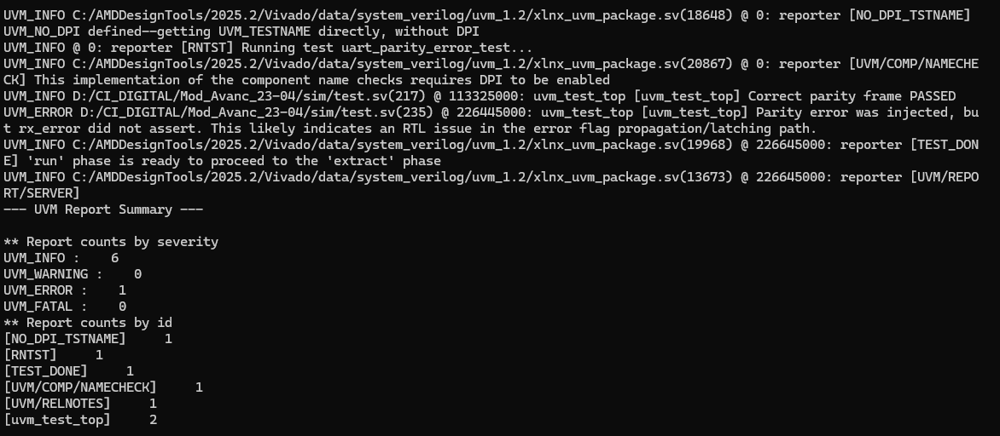

# SD242 – Atividade UVM UART

> ALUNO: Hyago Vieira Lemes Barbosa Silva | email: hyago.silva@mtel.inatel.br | hyagobora@gmail.com

## Objetivo
Foram desenvolvidos dois novos casos de teste independentes do teste original de comunicação, conforme solicitado na atividade. Os testes implementados avaliam elementos adicionais da UART, com foco em configuração e tratamento de erro.

## Arquivos alterados
- `sim/uart_bfm.sv`;
- `sim/test.sv`;
- `config.tcl` (apenas para selecionar qual teste será executado);

## Testes implementados
Para atender à atividade, foram adicionados os seguintes elementos no ambiente de verificação:

### Em `sim/uart_bfm.sv`
- task `send_with_bad_parity()`, criada para transmitir um quadro UART com bit de paridade invertido propositalmente, permitindo a injeção controlada de erro de paridade durante a simulação;

### Em `sim/test.sv`
- classe `uart_cfg_base_test`, utilizada como base para inicialização de clocks, reset e configuração do DUT;
- classe `uart_baud_rate_test`, criada para validar a operação da UART em diferentes baud rates;
- classe `uart_parity_error_test`, criada para validar o comportamento da UART diante de quadros com paridade correta e paridade incorreta;

## Teste 1 – Variação de baud rate
### Objetivo
Verificar se a UART opera corretamente com diferentes configurações de baud rate.

### Como foi feito
Foi criado o teste `uart_baud_rate_test`, que configura o DUT com diferentes baud rates através da interface de registradores e executa validações nos dois sentidos de comunicação:
- RX: envio serial via `uart_bfm.send()` e leitura via `reg_if_bfm.uart_receive()`;
- TX: envio via `reg_if_bfm.uart_send()` e captura serial via `uart_bfm.receive_tx()`;

### Cenários executados
- 9600 bps;
- 57600 bps;
- 115200 bps;

### Critério de aprovação
O byte transmitido em cada cenário deve ser igual ao byte observado na outra interface, confirmando que a configuração do baud rate foi aplicada corretamente no DUT.

### Resultado obtido
O teste foi executado com sucesso nos três cenários propostos. Todos os casos passaram sem erros fatais ou erros de verificação, indicando que a configuração de baud rate foi corretamente aplicada e interpretada pelo DUT.

## Teste 2 – Detecção de erro de paridade
### Objetivo
Verificar se a UART detecta corretamente quadros com erro de paridade.

### Como foi feito
Foi criado o teste `uart_parity_error_test`. Primeiro, um quadro com paridade correta é enviado para validar o caso nominal. Em seguida, foi adicionada no `uart_bfm` a task `send_with_bad_parity()`, responsável por enviar um quadro com o bit de paridade invertido propositalmente.

### Critério de aprovação
- Quadro correto: `rx_error = 0`;
- Quadro com erro de paridade: `rx_error = 1`;

### Resultado obtido
O quadro com paridade correta foi processado com sucesso. No entanto, no cenário com erro de paridade injetado, a flag `rx_error` não foi observada como ativa no momento da leitura, gerando erro de verificação no teste. Assim, o teste cumpriu seu papel de exercitar a funcionalidade e revelou uma possível limitação no RTL quanto à retenção ou propagação da sinalização de erro.

## Relatório de execução e Report Summary

### Execução do teste `uart_baud_rate_test`

Cenários executados:
- 9600 bps: PASSED;
- 57600 bps: PASSED;
- 115200 bps: PASSED;

Resumo do report:
- `UVM_INFO`: 11;
- `UVM_WARNING`: 0;
- `UVM_ERROR`: 0;
- `UVM_FATAL`: 0;

Conclusão:
O teste de baud rate foi aprovado com sucesso.

### Execução do teste `uart_parity_error_test`

Cenários executados:
- quadro com paridade correta: PASSED;
- quadro com erro de paridade injetado: falha esperada de observação, pois `rx_error` não foi acionado na leitura do status;

Resumo do report:
- `UVM_INFO`: 6;
- `UVM_WARNING`: 0;
- `UVM_ERROR`: 1;
- `UVM_FATAL`: 0;

Mensagem observada na simulação:
- `Parity error was injected, but rx_error did not assert`;

Conclusão:
O teste foi implementado corretamente e permitiu identificar uma possível limitação do design na sinalização do erro de paridade.

## Observação importante encontrada na simulação
Durante a análise do caminho de erro, foi identificado que o sinal `rx_error` pode estar sendo limpo antes de ficar disponível de forma estável no registrador de status. Isso indica uma possível falha de propagação ou latch do erro entre `rx_uart.sv` e `reg_bank.sv`.

Dessa forma, o problema não está necessariamente no caso de teste em si, mas possivelmente na forma como o RTL trata ou disponibiliza a flag de erro para leitura posterior.

## Como executar
Para selecionar o teste, alterar no `config.tcl` a variável:
- `set UVM_TEST "uart_baud_rate_test"`
ou
- `set UVM_TEST "uart_parity_error_test"`

Depois executar o fluxo normal com `run.tcl`.

## Conclusão final
Os dois casos de teste solicitados na atividade foram implementados com sucesso:
- um teste funcional de variação de baud rate;
- um teste de inserção/detecção de erro de paridade;

O primeiro foi aprovado integralmente em simulação. O segundo permitiu identificar um possível problema no RTL relacionado à observação da flag `rx_error`, o que também atende ao objetivo da atividade ao localizar e reportar comportamento inesperado identificado durante a simulação.